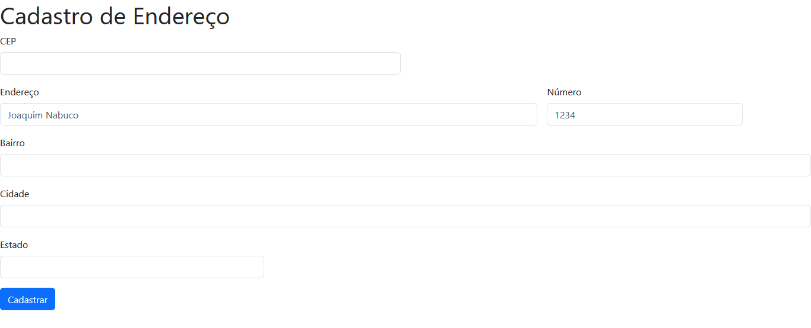

# Índice 

[Descrição](#descri%C3%A7%C3%A3o)  

[Funcionalidades](#funcionalidades)  

[Tecnologia ultilizadas](#tecnologia-ultilizadas)  

[Fontes consultadas](#fontes-consultadas)
 
[Como executar](#como-executar) 

[Contribuição](#contribuição) 

[Autores](#autores)  

#  Projeto de Endereço 📮

 
Projeto de Endereço que  visa armazenar as informações de endereços como o CEP, Endereço, Número, Bairro, Cidade e Estado 
com site reponsivo que é o Bootstrap.
 
 ## 📋 Descrição
Criação de projeto de Cadastro de Endereço é um sistema que permite aos usuários registrar informações detalhadas sobre um determinado endereço, incluindo cep, endereço, número, bairro, cidade e estado, essas informações são úteis para organizar e manter um registro preciso dos locais físicos, o sistema de cadastro de endereço facilita o armazenamento dessas informações, tornando mais eficiente o gerenciamento de dados de endereços.
## 🔧 Funcionalidades 
   Recursos
- `CEP`: Onde o usuário insere o  seu código postal.
- `Endereço`: Onde o usuário insere seu endereço.
- `Número`: Onde o usúario insere o número da sua casa.
- `Bairro`: Onde o usuário insere seu bairro
- `Cidade`: Onde o usuário insere a sua cidade.
- `Estado`: Onde o usuário insere o seu estado.
- `Cadastrar`: Botão para salvar os dados inseridos nos campos.
### 🛠️ Tecnologia ultilizadas
 CSS
 HTML
 JAVASCRIPT
 BOOTSTRAP
 ## 📄 Fontes consultadas
 https://getbootstrap.com/docs/5.0/getting-started/introduction/
 ## ➡️ Como executar
1. Clone este repositório.
2. Instale as dependências necessárias utilizando o comando [inserir comando].
3. Execute o projeto utilizando o comando [inserir comando].
## ✅ Contribuição
Contribuições são bem-vindas! Se você quiser colaborar com este projeto, siga os passos abaixo:
1. Faça um fork deste repositório.
2. Crie uma branch para a sua feature (`git checkout -b minha-feature`).
3. Faça commit das suas alterações (`git commit -m 'Adicionando nova funcionalidade'`).
4. Faça push para a branch criada (`git push origin minha-feature`).
5. Abra um Pull Request.

## ✒️ Autores
* Quezia Tamie Kato

